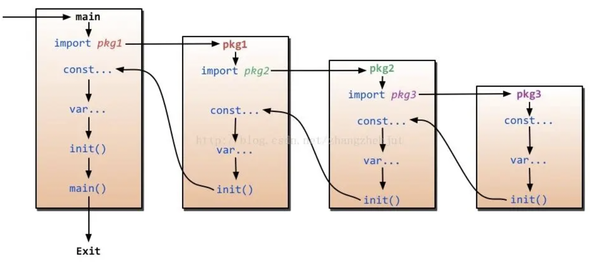

> 在一个 go 语言程序中，初始化顺序规则如下：

- 引入的包
- 当前包中的变量、常量
- 当前包的 init 函数
- main 函数

## 初始化顺序说明：

1. 在 go 源程序中，每一个被 import 的包，按照在源文件中出现顺序初始化。

2. 如果当前包有多个 init 函数在不同的源文件中，则按照源文件名以字典序从小到大排序，小的先被执行到。准确来说，应是按提交给编译器的源文件名顺序为准，只是在提交编译器之前，go 命令行工具对源文件名按字典序排序了。

3. 同一包且同一源文件中的 init 函数，则按其出现在文件中的先后顺序依次初始化。

4. init 函数只可以由 go runtine 自己调用，我们在代码中不可以显示调用，也不可以被引用。

5. 包 A 引入包 B，包 B 又引入包 C，则包的初始化顺序为： C -> B -> A

6. 引入包，必须避免死循环，如 A 引用 B， B 引用 C，C 引用 A。

7. 一个包被其它多个包引入，如 A -> B ->C 和 H -> I -> C，C 被其它包引用了 2 次，但是注意包 C 只被初始化一次，被依赖的总是先被初始化。

8. main包总是被最后一个初始化，因为它总是依赖别的包。

9. 同一个 go 文件中运行定义多个 init 函数，它们会按照定义顺序加载执行。